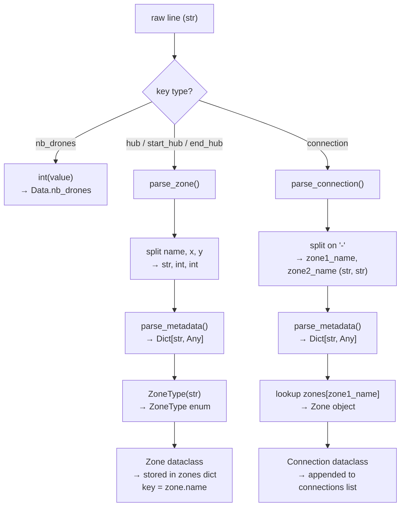
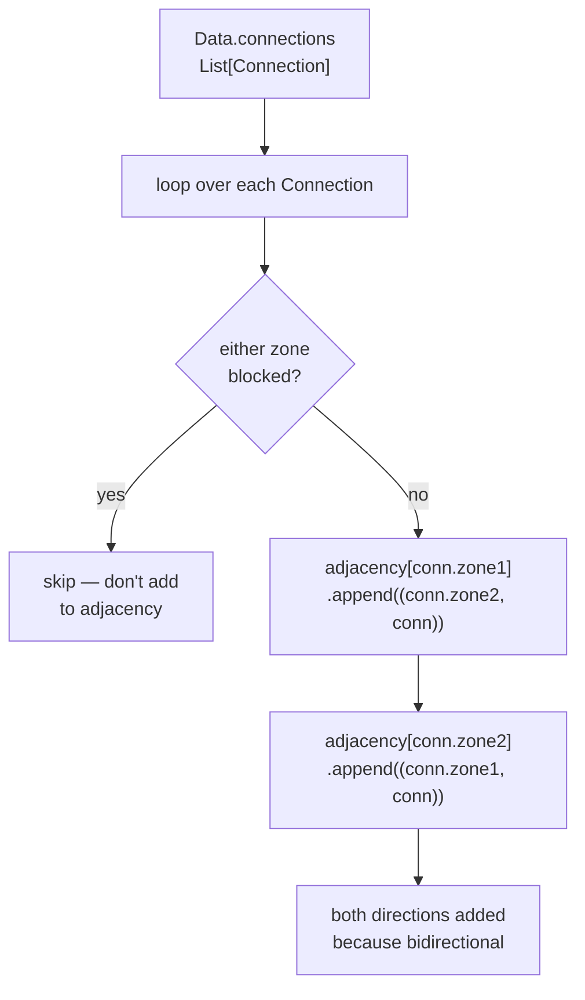
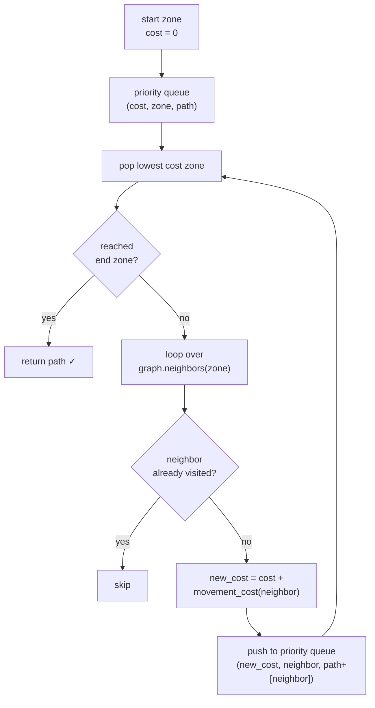
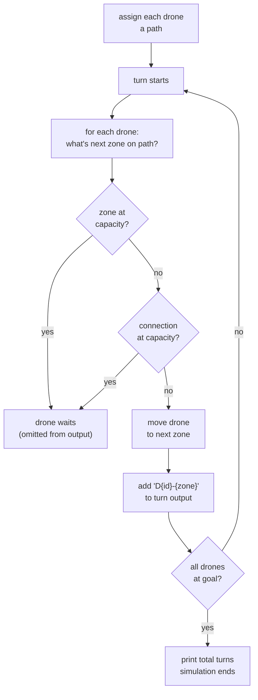
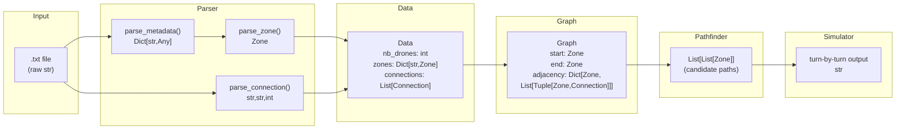

# 🚁 Fly-in — Data Flow & Architecture Notes

---

## Overview

The project transforms a raw `.txt` map file into a live drone simulation in 3 major stages:

```
.txt file ──► Parser ──► Data ──► Graph ──► Pathfinder ──► Simulator
  (str)               (objects)  (graph)    (paths)        (output)
```

Each stage has a clear input type and output type. Understanding this chain is the key to the whole project.

---

## Stage 1 — Raw File to Parsed Objects

### What goes in
A plain `.txt` file like:
```
nb_drones: 5
start_hub: hub 0 0 [color=green]
hub: roof1 3 4 [zone=restricted color=red]
connection: hub-roof1
```

### What comes out
A `Data` dataclass:
```python
Data(
    nb_drones = 5,                        # int
    zones = {                             # Dict[str, Zone]
        "hub":   Zone(name="hub",   x=0, y=0, is_start=True,  ...),
        "roof1": Zone(name="roof1", x=3, y=4, is_start=False, ...),
    },
    connections = [                       # List[Connection]
        Connection(
            zone1 = Zone("hub",   ...),   # Zone object (not a string!)
            zone2 = Zone("roof1", ...),   # Zone object (not a string!)
            max_link_capacity = 1
        )
    ]
)
```

### Data flow inside the parser



### Key type transformations in this stage

| Raw string | After parsing | Final type |
|---|---|---|
| `"5"` | `int("5")` | `int` |
| `"restricted"` | `ZoneType("restricted")` | `ZoneType` (enum) |
| `"3"` (coordinate) | `int("3")` | `int` |
| `"2"` (capacity) | `int("2")` | `int` |
| `"red"` (color) | kept as string | `str` or `None` |
| `"hub-roof1"` | split on `-` then lookup | `Zone, Zone` |

---

## Stage 2 — Data to Graph

### What goes in
The `Data` object from Stage 1.

### What comes out
A `Graph` object with an adjacency structure:
```python
Graph(
    start = Zone("hub", ...),
    end   = Zone("goal", ...),
    nb_drones = 5,
    adjacency = {                          # Dict[Zone, List[Tuple[Zone, Connection]]]
        Zone("hub"):   [(Zone("roof1"), Connection(...)), (Zone("corridorA"), Connection(...))],
        Zone("roof1"): [(Zone("hub"),   Connection(...)), (Zone("roof2"),     Connection(...))],
        ...
    }
)
```

### Why this transformation matters

Without this step, finding neighbors of a zone means scanning ALL connections every time — O(n) per lookup. With an adjacency list it's O(1).

### Data flow inside `Graph._build()`



### Key type transformations in this stage

| Input | Transformation | Output |
|---|---|---|
| `Connection.zone1` (Zone) | used as dict key | `Zone` (must be hashable) |
| `Connection` | stored as part of tuple | `Tuple[Zone, Connection]` |
| `List[Connection]` | expanded both ways | `Dict[Zone, List[Tuple[Zone, Connection]]]` |

### Why Zone must be hashable
Python dicts require keys to be hashable. By default dataclasses are not hashable if they're mutable. That's why you need:
```python
def __hash__(self) -> int:
    return hash(self.name)   # name is unique per zone

def __eq__(self, other: object) -> bool:
    if not isinstance(other, Zone):
        return False
    return self.name == other.name
```

---

## Stage 3 — Graph to Paths (Pathfinding)

### What goes in
- `Graph` object
- Start zone (`graph.start`)
- End zone (`graph.end`)

### What comes out
A list of paths — each path is an ordered list of zones from start to end:
```python
[
    [Zone("hub"), Zone("roof1"), Zone("roof2"), Zone("goal")],     # path 1
    [Zone("hub"), Zone("corridorA"), Zone("tunnelB"), Zone("goal")] # path 2
]
```

### The algorithm — Dijkstra's
Since zones have movement costs (normal=1, restricted=2), you need a weighted shortest path algorithm. Dijkstra's is the standard choice.



### Key type transformations

| Input | Transformation | Output |
|---|---|---|
| `Zone` | `graph.neighbors(zone)` | `List[Tuple[Zone, Connection]]` |
| `Zone.zone_type` | `movement_cost(zone)` | `int` (1 or 2) |
| sequence of zones | accumulated during search | `List[Zone]` (a path) |

---

## Stage 4 — Paths to Simulation

### What goes in
- List of paths (`List[List[Zone]]`)
- Number of drones (`int`)
- The `Graph` (for capacity checks)

### What comes out
Turn-by-turn output string:
```
D1-roof1 D2-corridorA
D1-roof2 D2-tunnelB
D1-goal D2-goal
```

### The simulation loop concept



---

## Full Data Flow Summary



---

## Type Cheat Sheet

| Object | Type | Key fields |
|---|---|---|
| `Data.nb_drones` | `int` | — |
| `Data.zones` | `Dict[str, Zone]` | key = zone name |
| `Data.connections` | `List[Connection]` | — |
| `Zone.zone_type` | `ZoneType` (enum) | `.value` = `"normal"` etc |
| `Zone.max_drones` | `int` | default 1 |
| `Connection.zone1` | `Zone` | actual object, not string |
| `Connection.zone2` | `Zone` | actual object, not string |
| `Connection.max_link_capacity` | `int` | default 1 |
| `Graph.adjacency` | `Dict[Zone, List[Tuple[Zone, Connection]]]` | built in `_build()` |
| path | `List[Zone]` | ordered start→end |

---

## Common Mistakes to Avoid

> [!warning] Zone names vs Zone objects
> After parsing, always work with `Zone` objects, never with zone name strings. The parser resolves names to objects so you don't have to do lookups later.

> [!warning] Blocked zones
> Filter them out in `Graph._build()` so the pathfinder never sees them. Don't handle them in the pathfinder itself.

> [!warning] Bidirectional connections
> Every `Connection` must be added twice in the adjacency list — once for each direction. Easy to forget.

> [!warning] Capacity timing
> When a drone moves OUT of a zone, that capacity is freed the SAME turn. So two drones can "swap" through a zone in a single turn if scheduled correctly.

---

## Resources

- [Graph representations — GeeksForGeeks](https://www.geeksforgeeks.org/graph-and-its-representations/)
- [Pathfinding visual intro — Red Blob Games](https://www.redblobgames.com/pathfinding/a-star/introduction.html)
- [Dijkstra's algorithm — Wikipedia](https://en.wikipedia.org/wiki/Dijkstra%27s_algorithm)
- [Python heapq — priority queue](https://docs.python.org/3/library/heapq.html)
- [Python defaultdict](https://docs.python.org/3/library/collections.html#collections.defaultdict)
- [Python dataclasses](https://docs.python.org/3/library/dataclasses.html)

---

*Tags: #fly-in #python #graph #pathfinding #drone-routing*